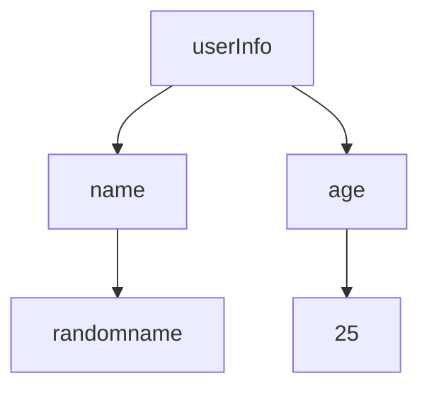

# Parser

Now that the string is broken into tokens, the next step is to evaluate if the tokens are actually valid together.

To validate and make the tokens ready for logical parsing, a natural fit for the complexity of the pieces would be a tree. Where the root node will hold all of the structure. And each node children would further have more objects. The leaf nodes of the tree would eventually have the most atomic entity (like booleans, strings & other raw data).

For example, let's take `{"userInfo": {"name": "random name", "age": 25}}`. The tree would look like as follows



If the tree cannot be built, there is a syntactic issue.

This tree is called the Abstract Syntax Tree, also known as `AST`. It abstracts away all details, removes irrelevant details like whitespace and works like a map for the program.

A lot of the developer tooling you live and use everyday works on top of ASTs, like compilers (`tsc` and such), static analysis tools (`mypy` and such), code transformation tools (`prettier` and such) and many others.

Building most of the trees is a recursive exercise, so let's read the token array and attempt to start building a tree. 

Let's start by defining the types of AST nodes

```python
class ASTNodeType(Enum):
    BOOLEAN = "BOOLEAN"
    STRING = "STRING"
    NULL = "NULL"
    OBJECT = "OBJECT"
```

and now a container to hold data of the AST node

```python
@dataclass
class ASTNode:
    node_type: ASTNodeType
    value: any
```

with the data structures out of the way, let's start working on the parser class. It takes in the list of tokens, and has a pointer for the current token its parsing.

```python
class Parser:
    current = 0

    def __init__(self, tokens: list[Token]):
        self.tokens = tokens
```

Let's also create an advance function which will move the cursor by one position & _returns the next token_ (This detail is important). 

```python
    def advance(self):
        self.current += 1
        return self.tokens[self.current]
```

let's define a recursive function to parse values, and let's start by parsing the most simple bits.

```python
    def parse_value(self):
        token = self.tokens[self.current]

        if token.token_type == TokenType.STRING:
            return ASTNode(node_type=ASTNodeType.STRING, value=token.value)
        elif token.token_type == TokenType.NULL:
            return ASTNode(node_type=ASTNodeType.NULL, value=None)
        elif token.token_type == TokenType.TRUE:
            return ASTNode(node_type=ASTNodeType.BOOLEAN, value=True)
        elif token.token_type == TokenType.FALSE:
            return ASTNode(node_type=ASTNodeType.BOOLEAN, value=False)
        elif token.token_type == TokenType.NUMBER:
            return ASTNode(node_type=ASTNodeType.STRING, value=int(token.value))
```

now if we encounter a open brace, it means that the next couple of tokens belong to an object. Which means until we encounter a closing brace, we'll have to keep parsing values recursively.

The logic is simple, start by eating the first token (since it'll anyways be `{`). And then keep moving along and keep parsing values. If we run into a string, then there should be a colon following and another value following the colon. If you run into a comma, move on and start looking for another string.

```python
    def parse_object(self):
        node = ASTNode(node_type=ASTNodeType.OBJECT, value={})
        node_after_advance = self.advance()  # eat {

        while node_after_advance.token_type != TokenType.BRACE_CLOSE:
            if node_after_advance.token_type == TokenType.STRING:
                key = node_after_advance.value
                node_after_advance = self.advance()
                if node_after_advance.token_type != TokenType.COLON:
                    raise Exception("colon expected")
                node_after_advance = self.advance()  # move after the colon
                value = self.parse_value()
                node.value[key] = value
            else:
                raise Exception("expected a string in key place")

            node_after_advance = self.advance()  # move after the brace close
            if node_after_advance.token_type == TokenType.COMMA:
                node_after_advance = self.advance()

        return node
```

This is the most important piece to wrap your head around. We recursively parse the array and build out a tree. Every JSON parse starts from here since every JSON is at the root object, and the recursive function keeps building out the tree. Once we hit the brace close, the tree has been built and the state stored in `node.value`.

Similarly, when we run into an array we iterate over elements and do a `parse_value`. Since arrays can also contain objects, or any other data types.

```python
    def parse_arr(self):
        arr = []
        node_after_advance = self.advance()  # eat the open brace
        while node_after_advance.token_type != TokenType.BRACKET_CLOSE:
            value = self.parse_value()
            arr.append(value)

            node_after_advance = self.advance()  # eat the comma after the value

            if node_after_advance.token_type == TokenType.COMMA:
                node_after_advance = self.advance()
        return arr
```

add the parsers to the parse function at the end

```python
        elif token.token_type == TokenType.BRACE_OPEN:
            return self.parse_object()
        elif token.token_type == TokenType.BRACKET_OPEN:
            return self.parse_arr()
        else:
            raise Exception("unknown type")
```

and a final `parse` function to kickoff the recursive operation.

```python
    def parse(self):
        return self.parse_value()
```

let's check the output now

```python
if __name__ == "__main__":
    tokenization_output = tokenize(
        """{
  "id": "6",
  "index": 0,
  "anArray": [{"arrayPos": 0}],
  "boolean": true,
  "nullValue": null
}""")
    parsed_values = Parser(tokens=tokenization_output).parse()
    print(
        parsed_values,
    )
# ASTNode(node_type=<ASTNodeType.OBJECT: 'OBJECT'>, value={'id': ASTNode(node_type=<ASTNodeType.STRING: 'STRING'>, value='6'), 'index': ASTNode(node_type=<ASTNodeType.STRING: 'STRING'>, value=0), 'anArray': [ASTNode(node_type=<ASTNodeType.OBJECT: 'OBJECT'>, value={'arrayPos': ASTNode(node_type=<ASTNodeType.STRING: 'STRING'>, value=0)})], 'boolean': ASTNode(node_type=<ASTNodeType.BOOLEAN: 'BOOLEAN'>, value=True), 'nullValue': ASTNode(node_type=<ASTNodeType.NULL: 'NULL'>, value=None)})
```

try to remove a colon or comma somewhere and see if the parser errors out. It should ideally.

That's it! That a the entire JSON parser. Congratulations on going through the entire journey. These fundamentals cascade into how languages are built from scratch as well!